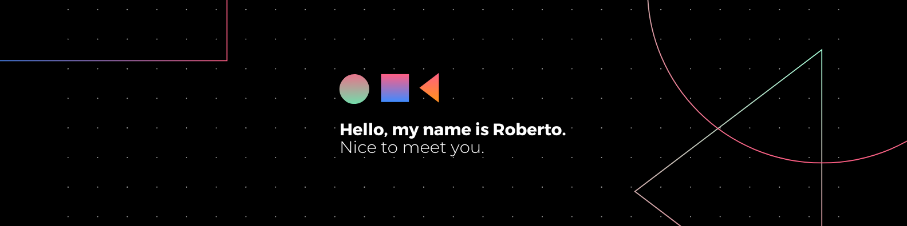

# Hello, I'm Roberto.

## MSc Artificial Intelligence @ VU Amsterdam

Former software engineer, about to graduate in Artificial Intelligence at Vrije
Universiteit Amsterdam.

My master's thesis focuses on exploring the benefits of applying Transformers
and RNN to RL algorithms.

My research interests are AI Safety & Alignment, Reinforcement Learning, NLP.

<h2>
    <picture>
        <source srcset="https://fonts.gstatic.com/s/e/notoemoji/latest/1f6f8/512.webp" type="image/webp">
        
    </picture>
    Technical skills
</h2>

<h2>
    <picture>
        <source srcset="https://fonts.gstatic.com/s/e/notoemoji/latest/1f44b_1f3fb/512.webp" type="image/webp">
        
    </picture>
    Connect with me
</h2>

